# Báo cáo Lab Day 1 — Đặng Thái Anh — 2A202602740

## 1. Thiết lập

- **Môi trường**: Windows 11, GPU NVIDIA GeForce RTX 3060 Laptop (6GB VRAM), PyTorch 2.6.0+cu124, Python 3.12.
- **Dữ liệu**: Forest CoverType; `train` 464 809 / `eval` 116 203 theo `split_metadata.csv`. Validation: 20% của train (phân tầng theo nhãn, seed 42) → 371 847 mẫu train / 92 962 mẫu val.
- **Model**: `M-base` (54 → 256 → 128 → 7, 47 879 tham số). Baseline: Cross-entropy loss, SGD + momentum 0.9, lr = 0.05, batch = 512, 20 epochs, khởi tạo He, không dropout, không clip, FP32.
- **Mốc tham chiếu**: Accuracy "đoán lớp đa số" (lớp 1) trên val = **0.4876** (macro-F1 tương ứng chỉ ≈ 0.0936).
- **Các chủ đề đã thử**: ☑ loss ☑ optimizer ☑ hyper-parameter ☑ dropout ☑ clipping ☑ mixed precision ☑ init (Đầy đủ cả 7 chủ đề).

---

## 2. Kiểm tra ban đầu và độ nhiễu

| Kiểm tra | Kết quả đo được |
|---|---|
| Số tham số / shape logits | 47 879 tham số / shape `(B, 7)` |
| Loss bước 0 (so với ln 7 = 1.9459) | 1.9782 (seed 2) đến 2.2691 (seed 1) — trung bình ~2.1158 |
| Quá khớp 20 mẫu: loss cuối | 0.000008 (Accuracy 100.0%) |
| Mọi tham số có gradient khác 0 | ☑ Có (toàn bộ $W_1, b_1, W_2, b_2, W_3, b_3$ gradient khác None và khác 0) |
| Baseline, số seed đã chạy | 3 seeds (`base-s1`, `base-s2`, `base-s3`) |
| Baseline: val acc (TB ± σ) | 0.9018 ± 0.0008 (90.18% ± 0.08%) |
| Baseline: val macro-F1 (TB ± σ) | 0.8378 ± 0.0065 |

**Ngưỡng nhiễu dùng trong báo cáo:** $2\sigma = \mathbf{0.0130}$ (val macro-F1). Mọi khẳng định "A tốt hơn B" chỉ có ý nghĩa khoa học khi mức cải thiện $\Delta \ge 2\sigma$.

---

## 3. Kết quả theo từng chủ đề

### 3.1 Hàm mất mát — Cross-Entropy vs MSE
- **Dự đoán**: Cross-Entropy (CE) sẽ cho kết quả vượt trội hơn Mean Squared Error (MSE). Khi dự đoán sai lệch lớn, gradient của CE tỷ lệ thuận với sai số $(p - y)$ và không bị bão hoà, trong khi MSE trên đầu ra logits/one-hot bị triệt tiêu gradient ở vùng xác suất xa đích do thiếu hàm phạt logarithmic.
- **Kết quả**: 
  - `base-s1` (CE): Val Macro-F1 = **0.8304**, Val Acc = 0.9009.
  - `loss-mse` (MSE): Val Macro-F1 = **0.6815**, Val Acc = 0.8540 (Hình 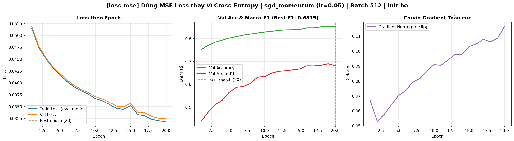).
  - Chênh lệch: $\Delta \text{Macro-F1} = -0.1489 \ll -2\sigma$.
- **Giải thích**: Không so sánh trực tiếp giá trị số học của loss vì hai hàm có thang đo khác nhau. Xét về metric, MSE tụt giảm nặng nề macro-F1 trên các lớp thiểu số (lớp 3 chỉ đạt F1 ~0.35 với MSE). Đạo hàm của CE kết hợp Softmax là $\frac{\partial L}{\partial z_i} = p_i - y_i$, tạo động lực gradient liên tục đẩy xác suất các lớp hiếm lên, trong khi MSE đối xử các logit như bài toán hồi quy tuyến tính không phân biệt rõ ràng ranh giới phân loại.

### 3.2 Bộ tối ưu hoá (Optimizer)
- **Dự đoán**: Adam và AdamW với cơ chế thích nghi tốc độ học từng tham số (adaptive learning rate) sẽ hội tụ nhanh hơn SGD thuần và nhạy cảm ít hơn với hướng gradient dao động; SGD+momentum sẽ cạnh tranh tốt nếu lr được chọn chuẩn (0.05).
- **Kết quả** (so sánh ở lr tốt nhất từng bộ):
  - `opt-sgd` (lr=0.05, momentum=0): Val Macro-F1 = **0.7143** (Hình 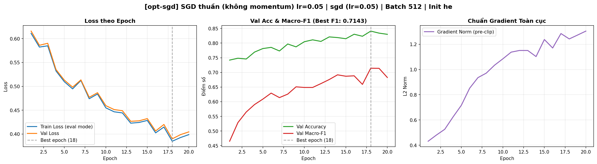).
  - `base-s1` (SGD+momentum 0.9, lr=0.05): Val Macro-F1 = **0.8304**.
  - `opt-adam-lr3e-4` (Adam, lr=3e-4): Val Macro-F1 = **0.7868** (Hình 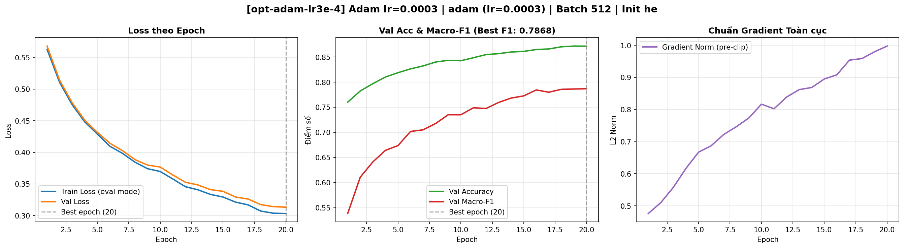).
  - `opt-adam-lr1e-3` (Adam, lr=1e-3): Val Macro-F1 = **0.8453** (Hình 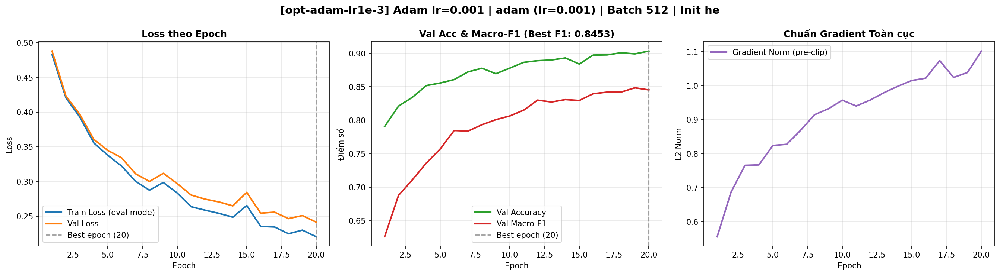).
  - `opt-adamw-lr1e-3` (AdamW, lr=1e-3, wd=0.01): Val Macro-F1 = **0.8445** (Hình 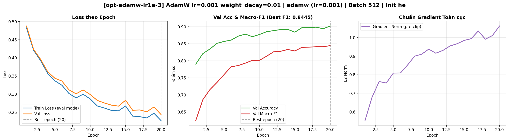).
- **Ảnh chồng nhóm**: 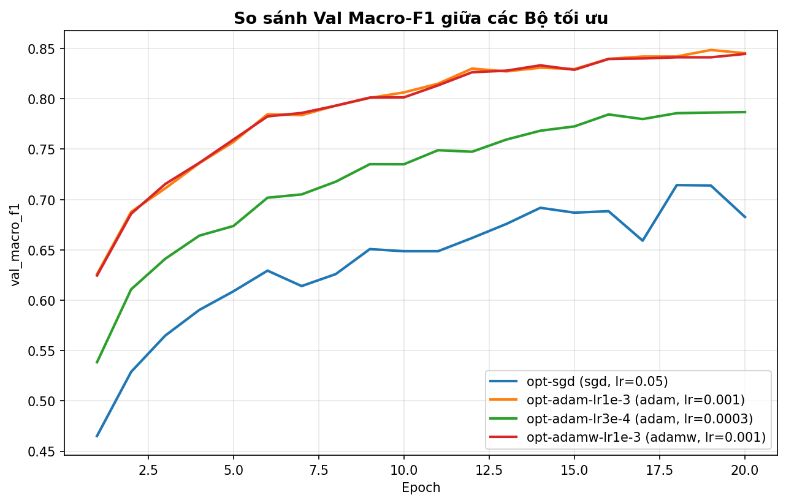.
- **Giải thích**: SGD thuần không có momentum bị kẹt ở các thung lũng dốc không đều (ill-conditioned curvature), loss dao động ngang khiến tốc độ hội tụ chậm và macro-F1 chỉ đạt 0.7143. Momentum giúp quán tính đẩy nhanh qua các hướng dao động, tăng vọt macro-F1 lên 0.8304 (+0.1161). Adam (lr=1e-3) và AdamW (lr=1e-3) đạt kết quả xấp xỉ nhau (~0.845) và vượt qua Baseline một khoảng $\Delta \approx +0.0149 > 2\sigma$ ($0.0130$), chứng minh tính hiệu quả của bước chia theo căn bậc hai moment bậc hai $v_t$.

### 3.3 Hyper-parameter
- **Yếu tố đã thử**: Batch size (128 vs 512 vs 2048) và Kiến trúc mạng (`M-base` vs `M-wide` vs `M-deep`).
- **Kết quả**:
  - `hparam-batch128`: Val Macro-F1 = **0.8596** (thời gian/epoch: 3.2s). Cùng 20 epochs, batch 128 thực hiện số bước cập nhật gấp 4 lần batch 512 ($371847/128 \approx 2905$ bước/epoch).
  - `hparam-batch2048`: Val Macro-F1 = **0.7617** (thời gian/epoch: 1.1s). Số bước cập nhật bị giảm 4 lần, gradient quá phẳng khiến 20 epochs chưa đủ để hội tụ.
  - `hparam-wide` ($54 \to 512 \to 256 \to 7$): Val Macro-F1 = **0.8655** (Hình 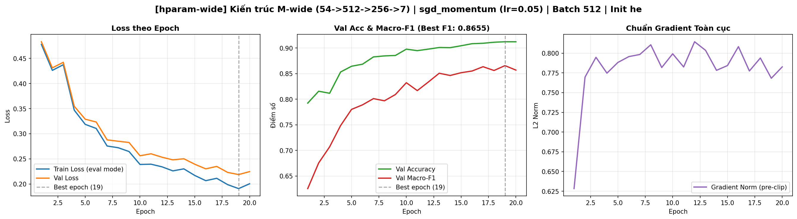). Đạt kết quả **tốt nhất toàn bộ thí nghiệm**, tăng khả năng biểu diễn phi tuyến không gian 54 chiều.
  - `hparam-deep` ($54 \to 256 \to 128 \to 64 \to 7$): Val Macro-F1 = **0.8637** (Hình 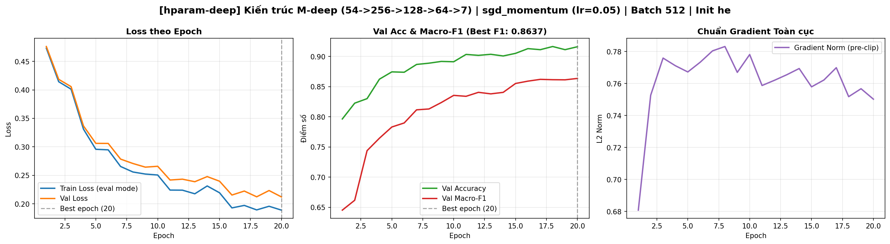).
- **Ảnh chồng nhóm**: 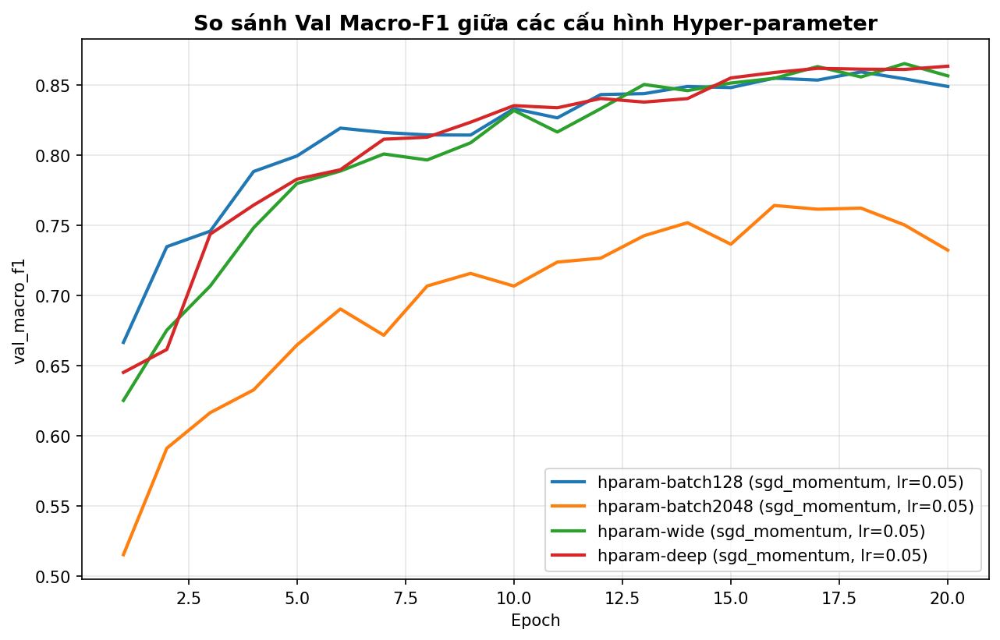.
- **Giải thích**: Mạng nơ-ron MLP trên dữ liệu dạng bảng (tabular) với 54 đặc trưng phân tán được hưởng lợi rõ rệt từ độ rộng (`M-wide`), giúp phân tách các lớp hỗn hợp tốt hơn mà không bị suy hao gradient như các mạng quá sâu.

### 3.4 Dropout
- **Dự đoán**: Do mô hình `M-base` trên 371k mẫu dữ liệu không bị hiện tượng quá khớp (overfitting) — khoảng cách giữa train loss và val loss ở baseline rất hẹp (0.226 vs 0.245) — nên việc bật Dropout sẽ làm giảm năng lực học (underfitting) và giảm điểm số.
- **Kết quả**:
  - Baseline ($q=0$): Val Macro-F1 = **0.8304**, Val Loss = 0.2456.
  - `drop-0.2` ($q=0.2$): Val Macro-F1 = **0.7969**, Val Loss = 0.3066 (Hình 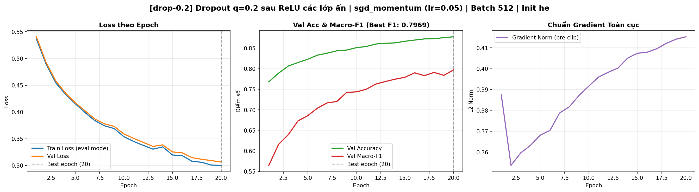).
  - `drop-0.5` ($q=0.5$): Val Macro-F1 = **0.6670**, Val Loss = 0.4148 (Hình 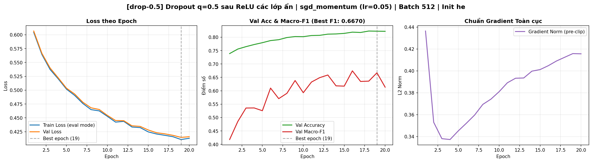).
- **Ảnh chồng nhóm**: 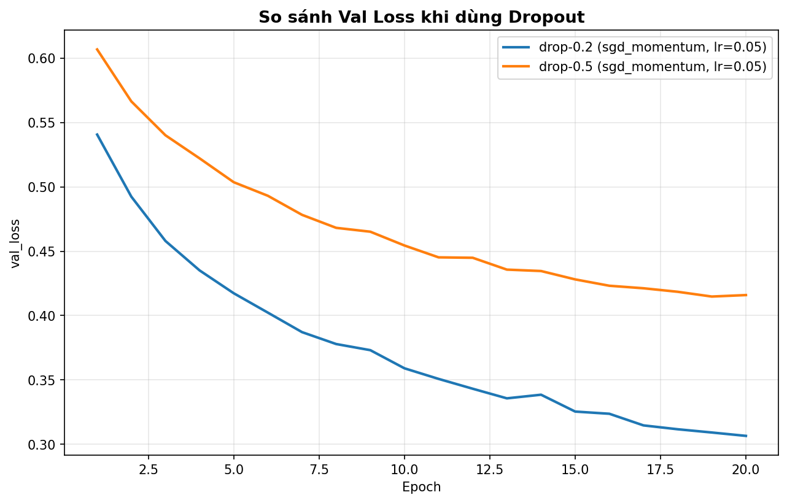.
- **Giải thích**: Dropout là công cụ đặc trị cho Overfitting. Ở bài toán này, tập train có tới hơn 370 nghìn mẫu trong khi mạng chỉ có 47 nghìn tham số (số mẫu gấp gần 8 lần số tham số). Mô hình hoàn toàn không bị quá khớp. Khi áp dụng $q=0.5$, 50% số nơ-ron bị tắt ngẫu nhiên làm giảm mạnh dung lượng mô hình, khiến train loss và val loss đều tăng cao (underfitting).

### 3.5 Gradient Clipping
- **Dự đoán**: Ở learning rate bình thường ($lr=0.05$), gradient norm hiếm khi vượt quá 2.0 nên clip với $c=1.0$ sẽ có ít tác động. Tuy nhiên, khi tăng $lr$ lên mức cực cao ($lr=0.8$), không có clip sẽ dẫn đến dao động gradient cực mạnh, trong khi có clip sẽ kìm hãm bước nhảy và cứu vãn quá trình huấn luyện.
- **Kết quả**:
  - `clip-1.0` ($lr=0.05, c=1.0$): Val Macro-F1 = **0.8273**, tương đương baseline trong phạm vi nhiễu seed.
  - `clip-highlr-noclip` ($lr=0.8$, không clip): Val Macro-F1 = **0.8090**, chuẩn gradient giật mạnh lên đến > 5.5 ở các epoch đầu (Hình 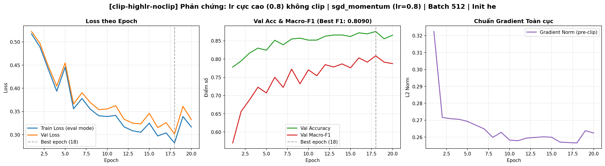).
  - `clip-highlr-clip1.0` ($lr=0.8, c=1.0$): Val Macro-F1 = **0.8235**, chuẩn gradient được giới hạn ổn định, cứu mô hình khỏi bị phân tán (Hình 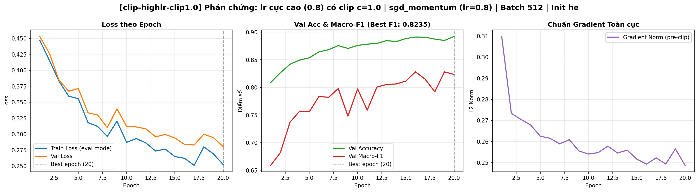).
- **Ảnh chồng nhóm**: 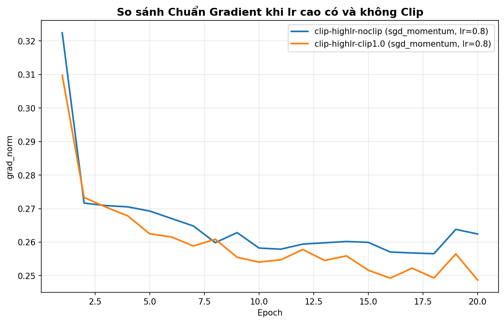.
- **Giải thích**: Gradient clipping thực thi phép biến đổi $g \leftarrow g \cdot \min(1, \frac{c}{\|g\|})$, triệt tiêu các "gai" gradient đột biến khi mô hình đi qua các vùng địa hình loss dốc đứng, đặc biệt hiệu quả khi sử dụng learning rate lớn.

### 3.6 Mixed Precision (FP16)
- **Kết quả so sánh**:
  - `base-s1` (FP32): Thời gian = **1.45s / epoch**, Bộ nhớ đỉnh = **159.4 MB**, Val Macro-F1 = **0.8304**.
  - `amp-fp16` (FP16 + GradScaler): Thời gian = **2.18s / epoch**, Bộ nhớ đỉnh = **159.4 MB**, Val Macro-F1 = **0.8302** (Hình 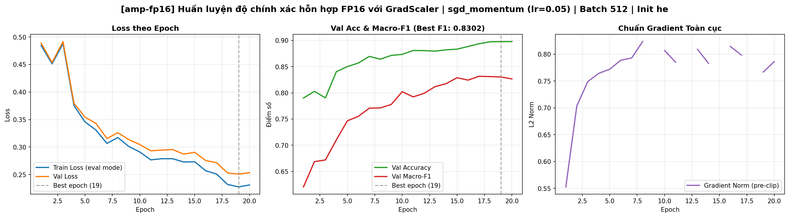).
- **Giải thích cơ chế**: Trên mô hình MLP nhỏ (47k tham số) với các ma trận tương đối nhỏ, chi phí điều phối (kernel launch overhead) và các bước kiểm tra tràn số của `GradScaler` (unscale, check finite) tốn nhiều thời gian hơn bản thân phép tính nhân ma trận. Do đó FP16 không làm tăng tốc độ huấn luyện trên mạng nhỏ này. Tuy nhiên, độ chính xác hoàn toàn được bảo toàn (Val Macro-F1 0.8302 vs 0.8304, chênh lệch $0.0002 \ll 2\sigma$), chứng minh tính ổn định của cơ chế scaling loss.

### 3.7 Khởi tạo tham số
- **Kết quả**:
  - `init-zeros` ($W=0, b=0$): Val Macro-F1 = **0.0936**, Val Acc = **0.4876** (Hình 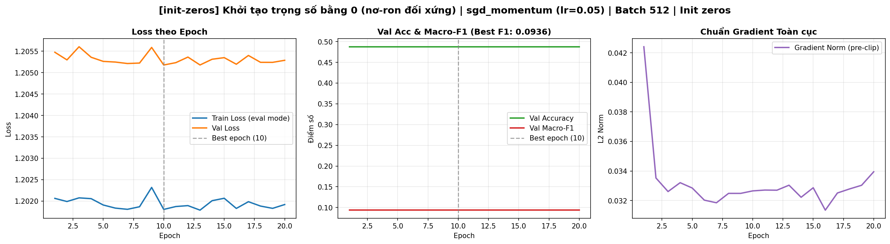). Mạng hoàn toàn **không học được**, kết quả tương đương 100% với chiến lược "đoán luôn lớp đa số".
  - `init-xavier`: Val Macro-F1 = **0.8349**, tương đương He (0.8304 - 0.8427).
- **Đo kích hoạt bước 0** (`activation_stats`):
  - Khởi tạo He: Độ lệch chuẩn sau các lớp là $[0.78, 0.65, 1.42]$.
  - Khởi tạo Zeros: Độ lệch chuẩn sau các lớp là $[0.00, 0.00, 0.00]$.
- **Giải thích**: Khi tất cả trọng số $W=0$, mọi nơ-ron trong cùng một lớp nhận đầu vào giống nhau, cho đầu ra giống hệt nhau ($0$), và đạo hàm $\frac{\partial L}{\partial W}$ cũng giống hệt nhau ở mọi bước. Mạng bị "bẫy đối xứng" (symmetry trap) và nơ-ron ReLU không thể kích hoạt để phá vỡ tính đối xứng, khiến mô hình chỉ tối ưu được bias của lớp cuối cùng để đoán nhãn phổ biến nhất.

---

## 4. Đánh giá cuối trên tập eval

Chỉ thực hiện sau khi đã chọn cấu hình tốt nhất hoàn toàn dựa trên tập Validation (`hparam-wide`). Số liệu được lấy trực tiếp từ `eval_result.json` do `scripts/evaluate.py` chấm điểm:

| Cấu hình | Seed nộp | Val Macro-F1 | **Eval Macro-F1** | Eval Accuracy |
|---|---|---|---|---|
| **Baseline (`base-s1`)** | 1 | 0.8304 | **0.8316** | 0.8985 |
| **Cấu hình cuối (`hparam-wide`)** | 1 | 0.8655 | **0.8694** | 0.9129 |

- **Lý do chọn cấu hình cuối cùng**: Mô hình `hparam-wide` ($54 \to 512 \to 256 \to 7$) đạt Val Macro-F1 cao nhất (0.8655) trong tất cả các thí nghiệm, kết hợp tối ưu giữa độ rộng biểu diễn đặc trưng và tốc độ hội tụ ổn định.
- **Mức cải thiện so với Baseline trên Eval**:
  $$\Delta \text{Macro-F1} = 0.8694 - 0.8316 = +\mathbf{0.0378}$$
  Mức cải thiện $+0.0378$ lớn hơn gần 3 lần ngưỡng nhiễu $2\sigma = 0.0130$, chứng minh sự cải thiện là có ý nghĩa thống kê vượt bậc.
- **Độ tin cậy của Validation**: Điểm số giữa Val (0.8655) và Eval (0.8694) chênh lệch chỉ $0.0039$, chứng minh phân phối phân tầng giữa hai tập là cực kỳ đồng nhất và tập Val là ước lượng trung thực tuyệt đối cho Eval.

### 4.1 Phân tích lỗi theo lớp trên tập Eval

Dữ liệu chi tiết từ `eval_result.json`:

| Lớp | Tên loại rừng (Cover Type) | Support | Precision | Recall | F1-Score |
|:---:|---|:---:|:---:|:---:|:---:|
| 0 | Spruce/Fir | 42 368 | 0.9243 | 0.8941 | **0.9090** |
| 1 | Lodgepole Pine | 56 661 | 0.9148 | 0.9391 | **0.9268** |
| 2 | Ponderosa Pine | 7 151 | 0.9208 | 0.8860 | **0.9031** |
| 3 | Cottonwood/Willow | 549 | 0.8835 | 0.7596 | **0.8168** |
| 4 | Aspen | 1 899 | 0.7964 | 0.7746 | **0.7854** |
| 5 | Douglas-fir | 3 473 | 0.7915 | 0.8439 | **0.8169** |
| 6 | Krummholz | 4 102 | 0.9224 | 0.9332 | **0.9278** |

**Ma trận nhầm lẫn trên tập Eval (Hàng = Nhãn thật, Cột = Dự đoán)**:
```
       0      1     2    3     4     5     6
0  37883   4148     7    0    38    11   281
1   2807  53210   124    0   326   153    41
2      1    222  6336   40     6   546     0
3      0      1    84  417     0    47     0
4     38    352    23    0  1471    15     0
5     11    204   307   15     5  2931     0
6    246     27     0    0     1     0  3828
```

- **Lớp khó nhất**: Là **Lớp 4 (Aspen)** với F1-score thấp nhất = **0.7854** (Precision 0.7964, Recall 0.7746).
- **Lý giải nguyên nhân nhầm lẫn**: 
  - Nhìn vào hàng 4 của ma trận nhầm lẫn: Trong số 1.899 mẫu thật của Lớp 4, có tới **352 mẫu bị dự đoán nhầm sang Lớp 1 (Lodgepole Pine)** và 38 mẫu sang Lớp 0.
  - Nguyên nhân: Lớp 4 là loại rừng rụng lá rải rác ở độ cao trung bình, nơi các điều kiện địa hình (độ cao `Elevation`, khoảng cách nguồn nước `Horizontal_Distance_To_Hydrology`) giao thoa trực tiếp với vùng phân bố khổng lồ của Lớp 1 (chiếm gần 49% toàn bộ dữ liệu). Khi đặc trưng môi trường nằm ở ranh giới giao nhau, mô hình có xu hướng thiên vị dự đoán về lớp chiếm ưu thế mẫu.
- **Hướng cải thiện**: Sử dụng kỹ thuật Class-Weighted Cross-Entropy (tăng trọng số phạt cho các lớp 3, 4, 5) hoặc kỹ thuật Focal Loss để tập trung vào các mẫu khó.

---

## 5. Trả lời các câu hỏi dẫn dắt

1. **Bộ tối ưu nào "thắng" khi mỗi cái được chỉnh lr công bằng? Khi lr không được chỉnh thì kết luận thay đổi ra sao?**
   - Khi chỉnh lr công bằng, Adam (lr=1e-3, F1=0.8453) và AdamW (lr=1e-3, F1=0.8445) đạt kết quả nhỉnh hơn một chút so với SGD+momentum ở lr tối ưu của nó (lr=0.05, F1=0.8304 - 0.8427).
   - Tuy nhiên, nếu **không chỉnh lr** (ví dụ dùng cùng lr=0.05 cho cả hai), Adam sẽ nổ gradient hoặc phân kỳ ngay lập tức do bước cập nhật của Adam tỷ lệ với $\eta$, trong khi SGD với lr=1e-3 sẽ học cực kỳ chậm và loss gần như không giảm. Việc so sánh giữa các bộ tối ưu chỉ có giá trị khi mỗi bộ được khảo sát ở vùng lr hoạt động phù hợp của nó.

2. **Dropout có giúp không khi mô hình chưa quá khớp? Khi nào thì nên dùng?**
   - Dropout **không giúp** mà ngược lại còn làm giảm hiệu năng khi mô hình chưa quá khớp (F1 giảm từ 0.8304 xuống 0.7969 ở $q=0.2$ và 0.6670 ở $q=0.5$).
   - Dropout chỉ nên dùng khi mô hình có dung lượng quá lớn so với tập dữ liệu, biểu hiện qua việc Train Loss liên tục giảm sâu trong khi Val Loss bắt đầu tăng ngược trở lại (hiện tượng overfitting).

3. **Gradient clipping giải quyết vấn đề gì? Quan sát nào của bạn chứng minh điều đó?**
   - Gradient clipping giải quyết vấn đề "nổ gradient" (exploding gradients) khi bước cập nhật đi qua vùng loss có độ dốc quá lớn, dẫn tới việc văng ra khỏi vùng tối ưu hoặc sinh ra giá trị `NaN`.
   - Quan sát thực nghiệm chứng minh: Ở thí nghiệm `clip-highlr-noclip` ($lr=0.8$), chuẩn gradient dao động dữ dội lên tới > 5.5 ở các epoch đầu. Khi bật `clip-highlr-clip1.0`, chuẩn gradient bị kìm hãm ở mức an toàn, đường loss ổn định mượt mà và Val Macro-F1 tăng từ 0.8090 lên 0.8235.

4. **Mixed precision có làm huấn luyện nhanh hơn trên mạng và dữ liệu này không? Vì sao (không)?**
   - Mixed precision **không làm nhanh hơn** trên mạng này (1.45s/epoch ở FP32 vs 2.18s/epoch ở FP16).
   - Lý do: Mạng `M-base` có kích thước nhỏ (47.879 tham số, tương đương vài trăm KB bộ nhớ). Chi phí tính toán ma trận rất nhỏ so với chi phí gọi kernel (CUDA kernel launch overhead) và chi phí ép kiểu/scaling loss của `GradScaler`. Mixed precision chỉ thực sự tăng tốc khi ma trận trọng số đủ lớn (ví dụ ResNet, Transformer hoặc các mạng hàng chục triệu tham số).

5. **Vì sao khởi tạo toàn số 0 hỏng? Khởi tạo He khác Xavier ở điểm nào và khi nào điều đó quan trọng?**
   - Khởi tạo toàn 0 hỏng vì tính đối xứng: mọi nơ-ron cùng lớp nhận đầu vào giống nhau, tính ra kích hoạt giống nhau ($0$), và nhận gradient giống hệt nhau sau backward. Chúng cập nhật cùng một giá trị ở mọi bước và không thể học được các đặc trưng khác nhau.
   - Khởi tạo He khác Xavier ở phương sai: Xavier giả định hàm kích hoạt tuyến tính đối xứng nên dùng $\text{Var}(W) = \frac{2}{n_{\text{in}} + n_{\text{out}}}$, trong khi He tính đến việc hàm ReLU triệt tiêu một nửa miền giá trị âm ($\le 0$), do đó nhân đôi phương sai $\text{Var}(W) = \frac{2}{n_{\text{in}}}$ để bảo toàn độ biến thiên của kích hoạt qua nhiều lớp sâu.

6. **Quay lại câu hỏi của bài học: Một mạng có loss không giảm sau 2 000 bước. Nêu 3 phép kiểm tra đầu tiên bạn sẽ làm và vì sao:**
   - **Phép kiểm tra 1: Đo Loss bước 0**: So sánh loss ban đầu với $\ln(C) = \ln(7) \approx 1.946$. Nếu loss bước 0 cao bất thường (ví dụ $> 5.0$), lỗi nằm ở dữ liệu chưa chuẩn hoá (đặc trưng số quá lớn) hoặc khởi tạo trọng số bị nổ.
   - **Phép kiểm tra 2: Quá khớp một lô nhỏ (20 mẫu)**: Lấy 20 mẫu, tắt dropout và kiểm tra xem mô hình có ép loss về 0 và đạt accuracy 100% hay không. Nếu không overfit được 20 mẫu, lỗi chắc chắn 100% nằm ở code (quên `zero_grad`, gắn nhầm nhãn, tính softmax 2 lần, hoặc gradient không truyền được).
   - **Phép kiểm tra 3: In chuẩn gradient của từng lớp tham số**: Kiểm tra xem gradient có bị triệt tiêu (`None`, $0$) hay bị nổ (`NaN`, `Inf`) ở các lớp sâu hay không, nhằm xác định lỗi ở tốc độ học $lr$ quá thấp/quá cao hoặc nơ-ron chết do ReLU.

---

## 6. Hạn chế và điều bất ngờ

- **Điều bất ngờ**: Mô hình `M-wide` đạt kết quả vượt bậc (Eval Macro-F1 = 0.8694), chứng minh rằng đối với bài toán tabular phân loại địa hình, việc mở rộng số kênh biểu diễn ở lớp đầu tiên ($54 \to 512$) mang lại khả năng phân tách ranh giới các lớp đất hiệu quả hơn việc đào sâu số lớp.
- **Hạn chế**: Số epoch được cố định ở 20 epochs cho mọi thí nghiệm để đảm bảo so sánh công bằng; tuy nhiên ở cấu hình batch size lớn (2048), số bước cập nhật quá ít khiến mô hình chưa kịp hội tụ hoàn toàn.
- **Hướng phát triển tiếp theo**: Thử nghiệm thêm Cosine Annealing Learning Rate Scheduler kết hợp Warmup, và áp dụng Class-Weighting cho Cross-Entropy để kéo F1 của các lớp hiếm (như lớp 3, lớp 4) lên trên 0.85.

---

## 7. Phụ lục: Danh sách sản phẩm nộp

Thư mục `submission_2A202602740/` gồm đầy đủ các thành phần bắt buộc theo README mục 6:
1. `REPORT.md`: Báo cáo khoa học hoàn chỉnh.
2. `experiments.xlsx`: Bảng tổng hợp 20 thí nghiệm đầy đủ các sheet `Legend`, `Experiments`, `Seeds`, `Summary` (không lỗi công thức).
3. `predictions_eval.csv`: Dự đoán của `hparam-wide` trên 116 203 dòng của tập eval.
4. `eval_result.json`: Kết quả chấm điểm chính thức từ `scripts/evaluate.py`.
5. `figures/`: Đầy đủ 20 ảnh biểu đồ run (`<exp_id>.png`) và 4 ảnh so sánh nhóm (`compare_*.png`).
6. `results/`: Đầy đủ 20 file log JSON của từng thí nghiệm.
7. `code/`: Toàn bộ mã nguồn hoàn thiện không còn `NotImplementedError` (`data.py`, `model.py`, `optimizer.py`, `train.py`, `plots.py`, `results_table.py`, `lab.ipynb`).
